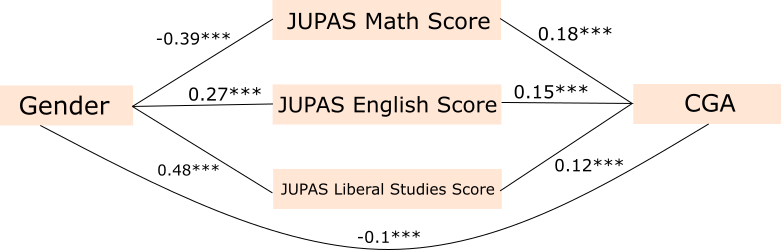
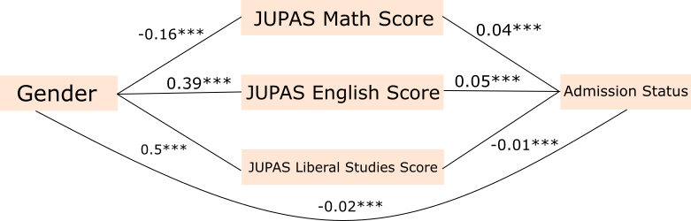

```{css echo=FALSE}
.main-container {
  max-width: 95%;
}

div.main-container {
  max-width: 95%;
}

#TOC {
    margin: 5% 0;
    font-size: 25px;
}

div.tocify {
    width: 20%;
    max-width: 20%;
    max-height: 80%;
}

.tocify .tocify-item a, .tocify .list-group-item {
    padding: 16px;
}

.btn-default {
    padding: 10px 20px;
    font-size: 18px;
}

.dropdown-menu {
  font-size: 18px
}

h1.title {
  font-size: 45px
}

h1 {
  font-size: 40px
}

h2 {
  font-size: 37px
}

h3 {
  font-size: 34px
}

h4 {
  font-size: 31px
}

h1, .h1, h2, .h2, h3, .h3, h4, .h4 {
    margin-top: 20px;
    margin-bottom: 10px;
}

pre {
  margin-left: 40px;
  font-size: 23px;
  width: 90%
}

.nav {
  font-size: 25px
}

ul, ol {
    margin-top: 20px;
    margin-left: 40px;
    margin-bottom: 10px;
}

.pagedtable-wrapper {
    margin-bottom: 10px;
    margin-top: 20px;
    margin-left: 40px;
    font-size: 23px;
    width: 90%;
}

p {
  font-size: 25px;
  margin-left: 40px;
  margin-top: 20px;
  margin-bottom: 10px;
  width: 90%
}

hr {
    margin-top: 20px;
    margin-bottom: 10px;
    border: 1px solid dimgray;
}

.table {
    font-size: 23px;
    width: auto;
    max-width: 100%;
    margin-top: 20px;
    margin-left: 40px;
    margin-bottom: 30px;
    border-collapse: separate;
    border-spacing: 15px;
    background-color: lavender;
}

.classA .table {
  margin-left: 0px;
  border-spacing: 0px;
}
```

# Overview

There are three sections in this report. In the first section, two datasets were created, the first one by adjoining the scores of JUPAS applicants with their program of choice, and the second dataset by adjoining the JUPAS applicant's application profile with their respective CGA performance in HKUST. In the second section is a multivariate regression on the gender gap in CGA performance. In the third section is a logistic regression on the gender biases in the admission process.

# Preparing the Environment {.tabset}

## Load Packages

```{r echo=TRUE, message=FALSE, warning=FALSE}
library(GenomicRanges)
library(tidyverse)
library(plotly)
library(ggthemes)
library(modelr)
library(coefplot)
library(effsize)
library(nortest)
library(lavaan)
```

## Import Dataset

```{r echo=TRUE, message=FALSE, warning=FALSE}
UG_Profile_With_CGA <- read_csv("Data/DM_UG_PROFILE_W_CGA.csv")
UG_JUPAS_Application_Score <- read_csv("Data/DM_UG_JUPAS_ADM_SCORE.csv")
UG_JUPAS_Application_Program <- read_csv("Data/DM_UG_JUPAS_ADM_SCORE_PROG.csv")
```

## Data Cleaning

```{r echo=TRUE, message=FALSE, warning=FALSE, paged.print=FALSE}
UG_JUPAS_Application_Score <- UG_JUPAS_Application_Score %>%
  select("Masked Appl Nbr", "Cohort Yr", "Sex Ind", "Score Rule Desc", "Score Value", "Status", "Reg Prog Nam", "Wh Stdt Key")

colnames(UG_JUPAS_Application_Score) <- c("Application_Number", "Cohort_Year", "Gender", "Score_Subject", "Score_Value",  "Enrollment_Status", "Registered_Program_Name", "Student_ID")

UG_JUPAS_Application_Score <- UG_JUPAS_Application_Score %>%
  arrange(Application_Number, Cohort_Year)

UG_JUPAS_Application_Program <- UG_JUPAS_Application_Program %>%
  select("Masked Appl Nbr", "Cohort Yr", "Prog Nam", "Wh Stdt Key")

colnames(UG_JUPAS_Application_Program) <- c("Application_Number", "Cohort_Year", "Applied_Program_Name", "Student_ID")

UG_JUPAS_Application_Program <- UG_JUPAS_Application_Program %>%
  arrange(Application_Number, Cohort_Year)

UG_Profile_With_CGA <- UG_Profile_With_CGA %>%
  select("Wh Stdt Key", "Cohort Term Acad Year", "Cohort Term Desc", "Snap Dat", "Sex Desc", "CGA",  "Study Yr", "Major Minor Cde", "Schl Cde", "Dept Cde", "Dept Formal Desc", "Ctzship Cntry Desc")

colnames(UG_Profile_With_CGA) <- c("Student_ID", "Cohort_Academic_Year", "Cohort_Academic_Term", "Snapped_Date", "Gender", "CGA", "Year_Of_Study", "Major_Minor", "School_Code", "Department_Code", "Department_Name", "Country_Of_Citizenship")

UG_Profile_With_CGA <- UG_Profile_With_CGA %>%
  filter(Country_Of_Citizenship == "Hong Kong SAR, China" & Cohort_Academic_Year %in% c(2019, 2020) & Year_Of_Study %in% c("01", "02")) %>%
  arrange(Student_ID, Cohort_Academic_Year)
```

## Set the Environment

```{r echo=TRUE, message=FALSE, warning=FALSE}
set.seed(229)
```

# Data Linkage {.tabset}

## Linking JUPAS Applicants' Scores with Their Program of Choice

```{r echo=TRUE, message=FALSE, warning=FALSE}
UG_JUPAS_Application_Score <- UG_JUPAS_Application_Score %>%
  pivot_wider(names_from = Score_Subject, values_from = Score_Value) %>%
  select("Application_Number", "Cohort_Year", "Gender", "#Unweight Best 5 (incl.M1M2)", "Best Math(Comp)", "Best English", "Best Liberal Studies", "Best Chinese (with NCS)", "Enrollment_Status", "Registered_Program_Name", "Student_ID") %>%
  rename(Overall_Score = `#Unweight Best 5 (incl.M1M2)`, Best_Math = `Best Math(Comp)`, Best_English = `Best English`, Best_Liberal_Studies = `Best Liberal Studies`, Best_Chinese = `Best Chinese (with NCS)`)

Linked_JUPAS_Application_Profile <- full_join(x = UG_JUPAS_Application_Program, y = UG_JUPAS_Application_Score, by = c("Application_Number", "Cohort_Year", "Student_ID")) %>%
  select("Application_Number", "Cohort_Year", "Gender", "Overall_Score", "Best_Math", "Best_English", "Best_Liberal_Studies", "Best_Chinese", "Applied_Program_Name", "Enrollment_Status", "Registered_Program_Name", "Student_ID") %>%
  mutate(
    Gender = case_when(
      Gender == "M" ~ "Male",
      Gender == "F" ~ "Female"
    )
  ) %>%
  mutate(
    Applied_School = case_when(
      Applied_Program_Name %in% c("Bachelor Degree SENG: 4Y", "BSc(MAEC): 4Y", "BSc(ISD): 4Y") ~ "SENG",
      Applied_Program_Name %in% c("Bachelor Degree SSCI: 4Y", "Bachelor Deg SSCI(Group B): 4Y", "Bachelor Degree SSCI (IRE): 4Y", "Bachelor Deg SSCI(Group A): 4Y") ~ "SSCI",
      Applied_Program_Name %in% c("Bachelor Degree SBM: 4Y", "BSc(QFIN): 4Y", "BBA(ECON): 4Y", "BBA(IS): 4Y", "BBA(ACCT): 4Y", "BBA(FINA): 4Y", "BBA(MGMT): 4Y", "BBA(OM): 4Y", "BSc(RMBI): 4Y", "BBA(MARK): 4Y", "BBA(GBUS): 4Y") ~ "SBM",
      Applied_Program_Name %in% c("BSc(GCS): 4Y", "Dual Degree Pgm-Tech&Mgt: 4Y", "BSc(EVMT): 4Y", "BSc(QSA): 4Y", "BSc(BIBU): 4Y", "BSc(ECOF): 4Y") ~ "SHSS & IPO"
    ),
    .before = "Applied_Program_Name"
  ) %>%
  mutate(
    Registered_School = case_when(
      Registered_Program_Name %in% c("Bachelor Degree SENG: 4Y", "BSc(MAEC): 4Y", "BSc(ISD): 4Y") ~ "SENG",
      Registered_Program_Name %in% c("Bachelor Degree SSCI: 4Y", "Bachelor Deg SSCI(Group B): 4Y", "Bachelor Degree SSCI (IRE): 4Y", "Bachelor Deg SSCI(Group A): 4Y") ~ "SSCI",
      Registered_Program_Name %in% c("Bachelor Degree SBM: 4Y", "BSc(QFIN): 4Y", "BBA(ECON): 4Y", "BBA(IS): 4Y", "BBA(ACCT): 4Y", "BBA(FINA): 4Y", "BBA(MGMT): 4Y", "BBA(OM): 4Y", "BSc(RMBI): 4Y", "BBA(MARK): 4Y", "BBA(GBUS): 4Y") ~ "SBM",
      Registered_Program_Name %in% c("BSc(GCS): 4Y", "Dual Degree Pgm-Tech&Mgt: 4Y", "BSc(EVMT): 4Y", "BSc(QSA): 4Y", "BSc(BIBU): 4Y", "BSc(ECOF): 4Y") ~ "SHSS & IPO"
    ),
    .before = "Registered_Program_Name"
  )
```

## Linking JUPAS Applicants' Profile with Their HKUST CGA

```{r echo=TRUE, message=FALSE, warning=FALSE}
Linked_JUPAS_With_CGA <- left_join(UG_Profile_With_CGA, Linked_JUPAS_Application_Profile %>% filter(Registered_Program_Name == Applied_Program_Name), by = c("Student_ID", "Cohort_Academic_Year" = "Cohort_Year", "Gender")) %>%
  select("Application_Number", "Student_ID", "Gender", "Cohort_Academic_Year", "Cohort_Academic_Term", "Snapped_Date", "Year_Of_Study", "Overall_Score", "Best_Math", "Best_English", "Best_Liberal_Studies", "Best_Chinese", "Major_Minor", "School_Code", "Department_Code", "Department_Name", "Registered_Program_Name", "CGA") %>%
  mutate(
    School_Code = case_when(
      School_Code %in% c("JS", "IPO", "SHSS") ~ "SHSS & IPO", 
      TRUE ~ School_Code
    )
  )
```

# Regression Analysis 1

## Method

[**Gender Gap in CGA Performance**]{.ul}

This regression analysis tests which variables account for academic performance, controlling for other possible factors that might be associated with gender. We also conducted tests of indirect effects to determine which potential intervening variables could help to explain the gender differences in grades. To explore intervening mechanisms for gender differences in grades, we used the JUPAS subject score of Math, English and Liberal Studies.

```{r echo=TRUE, message=FALSE, warning=FALSE}
regression_1_data <- Linked_JUPAS_With_CGA
```

------------------------------------------------------------------------

### Outcome Variable

#### College CGA

The outcome variable is the Cumulative Grade Point Average (CGA) of the students. The outcome variable follows a normal distribution both for the entire population and for the female/male population separately. An independent *t* test is conducted on the outcome variable to discover if academic outcomes varied by gender.

```{r echo=TRUE, eval=FALSE, message=FALSE, warning=FALSE}
d1 <- regression_1_data
d2 <- regression_1_data %>% filter(Gender == "Male")
d3 <- regression_1_data %>% filter(Gender == "Female")
length(d1$CGA)
length(d2$CGA)
length(d3$CGA)
mean(d1$CGA, na.rm = T)
mean(d2$CGA, na.rm = T)
mean(d3$CGA, na.rm = T)
sd(d1$CGA, na.rm = T)
sd(d2$CGA, na.rm = T)
sd(d3$CGA, na.rm = T)
var(d1$CGA, na.rm = T)
var(d2$CGA, na.rm = T)
var(d3$CGA, na.rm = T)
quantile(d1$CGA, na.rm = T)
quantile(d2$CGA, na.rm = T)
quantile(d3$CGA, na.rm = T)
ad.test(d1$CGA)
ad.test(d2$CGA)
ad.test(d3$CGA)
t.test(d2$CGA, d3$CGA)
cohen.d(d = d2$CGA, f = d3$CGA, formula = y ~ f, na.rm = T)
```

+---------------------------------+-----------------------+---------------------+---------------------+
| Variable: CGA                   | The Entire Population | Just Male           | Just Female         |
+:===============================:+:=====================:+:===================:+:===================:+
| Number of Observations          | 12208                 | 7431                | 4777                |
+---------------------------------+-----------------------+---------------------+---------------------+
| Mean                            | 2.76                  | 2.77                | 2.74                |
+---------------------------------+-----------------------+---------------------+---------------------+
| Standard Deviation              | 0.70                  | 0.73                | 0.64                |
+---------------------------------+-----------------------+---------------------+---------------------+
| Variance                        | 0.48                  | 0.53                | 0.41                |
+---------------------------------+-----------------------+---------------------+---------------------+
| Median                          | 2.84                  | 2.86                | 2.81                |
+---------------------------------+-----------------------+---------------------+---------------------+
| Anderson-Darling Normality Test | A = 102.32            | A = 59.00           | A = 44.79           |
+---------------------------------+-----------------------+---------------------+---------------------+
| Anderson-Darling Normality Test | p \< $2.2*10^{-16}$   | p \< $2.2*10^{-16}$ | p \< $2.2*10^{-16}$ |
+---------------------------------+-----------------------+---------------------+---------------------+

According to the results of the t test, women (M = 2.74, SD = 0.64) received lower grades than men (M = 2.77, SD = 0.73), CGA, t(7444) = 2.139, p = 0.032 \< 0.05, Cohen's d = 0.05 (negligible), 95% confidence interval (CI) of the true difference in means = [0.003, 0.063].

------------------------------------------------------------------------

### Predictor

#### Gender

Gender is treated as a dichotomous variable, with men coded as 0 and women coded as 1.

```{r echo=TRUE, message=FALSE, warning=FALSE}
regression_1_data <- regression_1_data %>%
  mutate(
    Female = case_when(
      Gender == "Male" ~ 0,
      Gender == "Female" ~ 1
    ),
    .after = Student_ID,
    Gender = NULL
  )

#length(regression_1_data$Female)
#sum(regression_1_data$Female, na.rm = T)
#mean(regression_1_data$Female, na.rm = T)
```

|   Variable: Female    | Statistics |
|:---------------------:|:----------:|
| Number of Observation |   12208    |
|          Sum          |    4777    |
|         Mean          |    0.39    |

------------------------------------------------------------------------

### Covariates {.tabset}

#### Academic Year

Academic Year is treated as a dichotomous variable, with the 2019 cohort coded as 0 and the 2020 cohort coded as 1.

```{r echo=TRUE, message=FALSE, warning=FALSE}
regression_1_data <- regression_1_data %>%
  mutate(
    Cohort_2020 = case_when(
      Cohort_Academic_Year == 2019 ~ 0,
      Cohort_Academic_Year == 2020 ~ 1
    ),
    .after = Female,
    Cohort_Academic_Year = NULL
  )

#length(regression_1_data$Cohort_2020)
#sum(regression_1_data$Cohort_2020, na.rm = T)
#mean(regression_1_data$Cohort_2020, na.rm = T)
```

| Variable: Cohort 2020 | Statistics |
|:---------------------:|:----------:|
| Number of Observation |   12208    |
|          Sum          |    4131    |
|         Mean          |    0.34    |

------------------------------------------------------------------------

#### Year of Study

Year of Study is treated as a dichotomous variable, with first year students coded as 0 and second year students coded as 1.

```{r echo=TRUE, message=FALSE, warning=FALSE}
regression_1_data <- regression_1_data %>%
  mutate(
    Second_Year = case_when(
      Year_Of_Study == "01" ~ 0,
      Year_Of_Study == "02" ~ 1
    ),
    .after = Snapped_Date,
    Year_Of_Study = NULL
  )

#length(regression_1_data$Second_Year)
#sum(regression_1_data$Second_Year, na.rm = T)
#mean(regression_1_data$Second_Year, na.rm = T)
```

| Variable: Second Year | Statistics |
|:---------------------:|:----------:|
| Number of Observation |   12208    |
|          Sum          |    4131    |
|         Mean          |    0.34    |

------------------------------------------------------------------------

#### School Name

An indicator variable is created for each of the three major schools in the sample: SBM, SENG and SSCI. These indicators will be coded as 0 if a student was not a member of the school and 1 if they do belong to that school. 0 on all indicators indicates a SHSS or IPO student.

```{r echo=TRUE, message=FALSE, warning=FALSE}
regression_1_data <- regression_1_data %>%
  mutate(
    SBM = case_when(
      School_Code == "SBM" ~ 1,
      TRUE ~ 0
    ),
    SENG = case_when(
      School_Code == "SENG" ~ 1,
      TRUE ~ 0
    ),
    SSCI = case_when(
      School_Code == "SSCI" ~ 1,
      TRUE ~ 0
    ),
    .after = Major_Minor,
    School_Code = NULL
  )

#length(regression_1_data$SBM)
#sum(regression_1_data$SBM, na.rm = T)
#mean(regression_1_data$SBM, na.rm = T)
#length(regression_1_data$SENG)
#sum(regression_1_data$SENG, na.rm = T)
#mean(regression_1_data$SENG, na.rm = T)
#length(regression_1_data$SSCI)
#sum(regression_1_data$SSCI, na.rm = T)
#mean(regression_1_data$SSCI, na.rm = T)
```

| Variable Name |      Statistics       | Values |
|:-------------:|:---------------------:|:------:|
|      SBM      | Number of Observation | 12208  |
|      SBM      |          Sum          |  3967  |
|      SBM      |         Mean          |  0.32  |
|     SENG      | Number of Observation | 12208  |
|     SENG      |          Sum          |  4172  |
|     SENG      |         Mean          |  0.34  |
|     SSCI      | Number of Observation | 12208  |
|     SSCI      |          Sum          |  2794  |
|     SSCI      |         Mean          |  0.23  |

------------------------------------------------------------------------

#### Major-Minor Code

The major-minor code indicates whether this CGA is for one's major or minor program. It is treated as a dichotomous variable, with major program coded as 0 and minor program coded as 1.

```{r echo=TRUE, message=FALSE, warning=FALSE}
regression_1_data <- regression_1_data %>%
  mutate(
    Minor = case_when(
      Major_Minor == "PMAJ" ~ 0,
      Major_Minor %in% c("OMAJ", "MIN") ~ 1
    ),
    .after = Best_Chinese,
    Major_Minor = NULL
  )

#length(regression_1_data$Minor)
#sum(regression_1_data$Minor, na.rm = T)
#mean(regression_1_data$Minor, na.rm = T)
```

|    Variable: Minor    | Statistics |
|:---------------------:|:----------:|
| Number of Observation |   12208    |
|          Sum          |    349     |
|         Mean          |   0.029    |

------------------------------------------------------------------------

#### JUPAS Overall Score

The Overall JUPAS Score, or Unweighted Best 5, is a numeric variable used as a control variable. It follows a normal distribution both for the entire population and for female/male population separately. An independent *t* test is conducted on this variable to discover if the mean of the overall score varied by gender.

```{r echo=TRUE, eval=FALSE, message=FALSE, warning=FALSE}
d1 <- regression_1_data
d2 <- regression_1_data %>% filter(Female == 0)
d3 <- regression_1_data %>% filter(Female == 1)
length(d1$Overall_Score)
length(d2$Overall_Score)
length(d3$Overall_Score)
mean(d1$Overall_Score, na.rm = T)
mean(d2$Overall_Score, na.rm = T)
mean(d3$Overall_Score, na.rm = T)
sd(d1$Overall_Score, na.rm = T)
sd(d2$Overall_Score, na.rm = T)
sd(d3$Overall_Score, na.rm = T)
var(d1$Overall_Score, na.rm = T)
var(d2$Overall_Score, na.rm = T)
var(d3$Overall_Score, na.rm = T)
quantile(d1$Overall_Score, na.rm = T)
quantile(d2$Overall_Score, na.rm = T)
quantile(d3$Overall_Score, na.rm = T)
ad.test(d1$Overall_Score)
ad.test(d2$Overall_Score)
ad.test(d3$Overall_Score)
t.test(d2$Overall_Score, d3$Overall_Score)
cohen.d(d = d2$Overall_Score, f = d3$Overall_Score, formula = y ~ f, na.rm = T)
```

+---------------------------------+-----------------------+---------------------+---------------------+
| Variable: Overall Score         | The Entire Population | Just Male           | Just Female         |
+:===============================:+:=====================:+:===================:+:===================:+
| Number of Observations          | 12208                 | 7431                | 4777                |
+---------------------------------+-----------------------+---------------------+---------------------+
| Mean                            | 23.56                 | 23.72               | 23.32               |
+---------------------------------+-----------------------+---------------------+---------------------+
| Standard Deviation              | 3.34                  | 3.46                | 3.14                |
+---------------------------------+-----------------------+---------------------+---------------------+
| Variance                        | 11.13                 | 11.96               | 9.83                |
+---------------------------------+-----------------------+---------------------+---------------------+
| Median                          | 23                    | 23                  | 23                  |
+---------------------------------+-----------------------+---------------------+---------------------+
| Anderson-Darling Normality Test | A = 297.18            | A = 161.62          | A = 133.06          |
+---------------------------------+-----------------------+---------------------+---------------------+
| Anderson-Darling Normality Test | p \< $2.2*10^{-16}$   | p \< $2.2*10^{-16}$ | p \< $2.2*10^{-16}$ |
+---------------------------------+-----------------------+---------------------+---------------------+

According to the results of the t test, women (M = 23.32, SD = 3.14) received lower scores than men (M = 23.72, SD = 3.46), CGA, t(9342) = 5.92, p = $3.32*10^{-9}$ \< 0.001, Cohen's d = 0.118 (negligible), 95% confidence interval (CI) of the true difference in means = [0.263, 0.524].

------------------------------------------------------------------------

### Intervening Variables {.tabset}

#### JUPAS Math Score

JUPAS Math Score, a numeric variable, will be used to test for any mediation effects between gender and CGA. It follows a normal distribution both for the entire population and for female/male population separately. An independent *t* test is conducted on this variable to discover if the mean of the Math score varied by gender.

```{r echo=TRUE, eval=FALSE, message=FALSE, warning=FALSE}
d1 <- regression_1_data
d2 <- regression_1_data %>% filter(Female == 0)
d3 <- regression_1_data %>% filter(Female == 1)
length(d1$Best_Math)
length(d2$Best_Math)
length(d3$Best_Math)
mean(d1$Best_Math, na.rm = T)
mean(d2$Best_Math, na.rm = T)
mean(d3$Best_Math, na.rm = T)
sd(d1$Best_Math, na.rm = T)
sd(d2$Best_Math, na.rm = T)
sd(d3$Best_Math, na.rm = T)
var(d1$Best_Math, na.rm = T)
var(d2$Best_Math, na.rm = T)
var(d3$Best_Math, na.rm = T)
quantile(d1$Best_Math, na.rm = T)
quantile(d2$Best_Math, na.rm = T)
quantile(d3$Best_Math, na.rm = T)
ad.test(d1$Best_Math)
ad.test(d2$Best_Math)
ad.test(d3$Best_Math)
t.test(d2$Best_Math, d3$Best_Math)
cohen.d(d = d2$Best_Math, f = d3$Best_Math, formula = y ~ f, na.rm = T)
```

+---------------------------------+-----------------------+---------------------+---------------------+
| Variable: Math Score            | The Entire Population | Just Male           | Just Female         |
+:===============================:+:=====================:+:===================:+:===================:+
| Number of Observations          | 12208                 | 7431                | 4777                |
+---------------------------------+-----------------------+---------------------+---------------------+
| Mean                            | 4.95                  | 5.11                | 4.71                |
+---------------------------------+-----------------------+---------------------+---------------------+
| Standard Deviation              | 0.93                  | 0.94                | 0.88                |
+---------------------------------+-----------------------+---------------------+---------------------+
| Variance                        | 0.873                 | 0.875               | 0.778               |
+---------------------------------+-----------------------+---------------------+---------------------+
| Median                          | 5                     | 5                   | 5                   |
+---------------------------------+-----------------------+---------------------+---------------------+
| Anderson-Darling Normality Test | A = 540.56            | A = 308.97          | A = 260.63          |
+---------------------------------+-----------------------+---------------------+---------------------+
| Anderson-Darling Normality Test | p \< $2.2*10^{-16}$   | p \< $2.2*10^{-16}$ | p \< $2.2*10^{-16}$ |
+---------------------------------+-----------------------+---------------------+---------------------+

According to the results of the t test, women (M = 4.71, SD = 0.88) received lower math scores than men (M = 5.11, SD = 0.94), CGA, t(9148) = 21.49, p \< $2.2*10^{-16}$ \< 0.001, Cohen's d = 0.432 (small), 95% confidence interval (CI) of the true difference in means = [0.359, 0.431].

------------------------------------------------------------------------

#### JUPAS English Score

JUPAS English Score, a numeric variable, will be used to test for any mediation effects between gender and CGA. It follows a normal distribution both for the entire population and for female/male population separately. An independent *t* test is conducted on this variable to discover if the mean of the English score varied by gender.

```{r echo=TRUE, eval=FALSE, message=FALSE, warning=FALSE}
d1 <- regression_1_data
d2 <- regression_1_data %>% filter(Female == 0)
d3 <- regression_1_data %>% filter(Female == 1)
length(d1$Best_English)
length(d2$Best_English)
length(d3$Best_English)
mean(d1$Best_English, na.rm = T)
mean(d2$Best_English, na.rm = T)
mean(d3$Best_English, na.rm = T)
sd(d1$Best_English, na.rm = T)
sd(d2$Best_English, na.rm = T)
sd(d3$Best_English, na.rm = T)
var(d1$Best_English, na.rm = T)
var(d2$Best_English, na.rm = T)
var(d3$Best_English, na.rm = T)
quantile(d1$Best_English, na.rm = T)
quantile(d2$Best_English, na.rm = T)
quantile(d3$Best_English, na.rm = T)
ad.test(d1$Best_English)
ad.test(d2$Best_English)
ad.test(d3$Best_English)
t.test(d2$Best_English, d3$Best_English)
cohen.d(d = d2$Best_English, f = d3$Best_English, formula = y ~ f, na.rm = T)
```

+---------------------------------+-----------------------+---------------------+---------------------+
| Variable: English Score         | The Entire Population | Just Male           | Just Female         |
+:===============================:+:=====================:+:===================:+:===================:+
| Number of Observations          | 12208                 | 7431                | 4777                |
+---------------------------------+-----------------------+---------------------+---------------------+
| Mean                            | 4.22                  | 4.11                | 4.37                |
+---------------------------------+-----------------------+---------------------+---------------------+
| Standard Deviation              | 0.93                  | 0.93                | 0.91                |
+---------------------------------+-----------------------+---------------------+---------------------+
| Variance                        | 0.866                 | 0.864               | 0.827               |
+---------------------------------+-----------------------+---------------------+---------------------+
| Median                          | 4                     | 4                   | 4                   |
+---------------------------------+-----------------------+---------------------+---------------------+
| Anderson-Darling Normality Test | A = 604.09            | A = 361.71          | A = 265.79          |
+---------------------------------+-----------------------+---------------------+---------------------+
| Anderson-Darling Normality Test | p \< $2.2*10^{-16}$   | p \< $2.2*10^{-16}$ | p \< $2.2*10^{-16}$ |
+---------------------------------+-----------------------+---------------------+---------------------+

According to the results of the t test, women (M = 4.37, SD = 0.91) received higher English scores than men (M = 4.11, SD = 0.93), CGA, t(8953) = -14.06, p \< $2.2*10^{-16}$ \< 0.001, Cohen's d = -0.285 (small), 95% confidence interval (CI) of the true difference in means = [-0.299, -0.226].

------------------------------------------------------------------------

#### JUPAS Liberal Study Score

JUPAS Liberal Study Score, a numeric variable, will be used to test for any mediation effects between gender and CGA. It follows a normal distribution both for the entire population and for female/male population separately. An independent *t* test is conducted on this variable to discover if the mean of the Liberal Study score varied by gender.

```{r echo=TRUE, eval=FALSE, message=FALSE, warning=FALSE}
d1 <- regression_1_data
d2 <- regression_1_data %>% filter(Female == 0)
d3 <- regression_1_data %>% filter(Female == 1)
length(d1$Best_Liberal_Studies)
length(d2$Best_Liberal_Studies)
length(d3$Best_Liberal_Studies)
mean(d1$Best_Liberal_Studies, na.rm = T)
mean(d2$Best_Liberal_Studies, na.rm = T)
mean(d3$Best_Liberal_Studies, na.rm = T)
sd(d1$Best_Liberal_Studies, na.rm = T)
sd(d2$Best_Liberal_Studies, na.rm = T)
sd(d3$Best_Liberal_Studies, na.rm = T)
var(d1$Best_Liberal_Studies, na.rm = T)
var(d2$Best_Liberal_Studies, na.rm = T)
var(d3$Best_Liberal_Studies, na.rm = T)
quantile(d1$Best_Liberal_Studies, na.rm = T)
quantile(d2$Best_Liberal_Studies, na.rm = T)
quantile(d3$Best_Liberal_Studies, na.rm = T)
ad.test(d1$Best_Liberal_Studies)
ad.test(d2$Best_Liberal_Studies)
ad.test(d3$Best_Liberal_Studies)
t.test(d2$Best_Liberal_Studies, d3$Best_Liberal_Studies)
cohen.d(d = d2$Best_Liberal_Studies, f = d3$Best_Liberal_Studies, formula = y ~ f, na.rm = T)
```

+---------------------------------+-----------------------+---------------------+---------------------+
| Variable: Liberal Studies       | The Entire Population | Just Male           | Just Female         |
+:===============================:+:=====================:+:===================:+:===================:+
| Number of Observations          | 12208                 | 7431                | 4777                |
+---------------------------------+-----------------------+---------------------+---------------------+
| Mean                            | 4.04                  | 3.85                | 4.31                |
+---------------------------------+-----------------------+---------------------+---------------------+
| Standard Deviation              | 0.90                  | 0.87                | 0.89                |
+---------------------------------+-----------------------+---------------------+---------------------+
| Variance                        | 0.817                 | 0.754               | 0.784               |
+---------------------------------+-----------------------+---------------------+---------------------+
| Median                          | 4                     | 4                   | 4                   |
+---------------------------------+-----------------------+---------------------+---------------------+
| Anderson-Darling Normality Test | A = 723.43            | A = 417.64          | A = 356.79          |
+---------------------------------+-----------------------+---------------------+---------------------+
| Anderson-Darling Normality Test | p \< $2.2*10^{-16}$   | p \< $2.2*10^{-16}$ | p \< $2.2*10^{-16}$ |
+---------------------------------+-----------------------+---------------------+---------------------+

According to the results of the t test, women (M = 4.31, SD = 0.89) received higher Liberal Study scores than men (M = 3.85, SD = 0.87), CGA, t(8724) = -25.55, p \< $2.2*10^{-16}$ \< 0.001, Cohen's d = -0.521 (medium), 95% confidence interval (CI) of the true difference in means = [-0.491, -0.421].

------------------------------------------------------------------------

## Results

Below is the tables for bivariate correlations, model coefficients estimate and the path diagram for the mediation effect.

### Correlation Table {.classA}

```{r echo=TRUE, eval=FALSE, message=FALSE, warning=FALSE}
phicoef(regression_1_data$Female %>% as.logical(), regression_1_data$Cohort_2020 %>% as.logical())
phicoef(regression_1_data$Female %>% as.logical(), regression_1_data$Second_Year %>% as.logical())
phicoef(regression_1_data$Female %>% as.logical(), regression_1_data$SBM %>% as.logical())
phicoef(regression_1_data$Female %>% as.logical(), regression_1_data$SENG %>% as.logical())
phicoef(regression_1_data$Female %>% as.logical(), regression_1_data$SSCI %>% as.logical())
phicoef(regression_1_data$Female %>% as.logical(), regression_1_data$Minor %>% as.logical())

phicoef(regression_1_data$Cohort_2020 %>% as.logical(), regression_1_data$Second_Year %>% as.logical())
phicoef(regression_1_data$Cohort_2020 %>% as.logical(), regression_1_data$SBM %>% as.logical())
phicoef(regression_1_data$Cohort_2020 %>% as.logical(), regression_1_data$SENG %>% as.logical())
phicoef(regression_1_data$Cohort_2020 %>% as.logical(), regression_1_data$SSCI %>% as.logical())
phicoef(regression_1_data$Cohort_2020 %>% as.logical(), regression_1_data$Minor %>% as.logical())

phicoef(regression_1_data$Second_Year %>% as.logical(), regression_1_data$SBM %>% as.logical())
phicoef(regression_1_data$Second_Year %>% as.logical(), regression_1_data$SENG %>% as.logical())
phicoef(regression_1_data$Second_Year %>% as.logical(), regression_1_data$SSCI %>% as.logical())
phicoef(regression_1_data$Second_Year %>% as.logical(), regression_1_data$Minor %>% as.logical())

phicoef(regression_1_data$SBM %>% as.logical(), regression_1_data$SENG %>% as.logical())
phicoef(regression_1_data$SBM %>% as.logical(), regression_1_data$SSCI %>% as.logical())
phicoef(regression_1_data$SBM %>% as.logical(), regression_1_data$Minor %>% as.logical())

phicoef(regression_1_data$SENG %>% as.logical(), regression_1_data$SSCI %>% as.logical())
phicoef(regression_1_data$SENG %>% as.logical(), regression_1_data$Minor %>% as.logical())

phicoef(regression_1_data$SSCI %>% as.logical(), regression_1_data$Minor %>% as.logical())

cor.test(regression_1_data$Overall_Score, regression_1_data$Female)
cor.test(regression_1_data$Overall_Score, regression_1_data$Cohort_2020)
cor.test(regression_1_data$Overall_Score, regression_1_data$Second_Year)
cor.test(regression_1_data$Overall_Score, regression_1_data$SBM)
cor.test(regression_1_data$Overall_Score, regression_1_data$SENG)
cor.test(regression_1_data$Overall_Score, regression_1_data$SSCI)
cor.test(regression_1_data$Overall_Score, regression_1_data$Minor)

cor.test(regression_1_data$Best_Math, regression_1_data$Female)
cor.test(regression_1_data$Best_Math, regression_1_data$Cohort_2020)
cor.test(regression_1_data$Best_Math, regression_1_data$Second_Year)
cor.test(regression_1_data$Best_Math, regression_1_data$SBM)
cor.test(regression_1_data$Best_Math, regression_1_data$SENG)
cor.test(regression_1_data$Best_Math, regression_1_data$SSCI)
cor.test(regression_1_data$Best_Math, regression_1_data$Minor)
cor.test(regression_1_data$Best_Math, regression_1_data$Overall_Score)

cor.test(regression_1_data$Best_English, regression_1_data$Female)
cor.test(regression_1_data$Best_English, regression_1_data$Cohort_2020)
cor.test(regression_1_data$Best_English, regression_1_data$Second_Year)
cor.test(regression_1_data$Best_English, regression_1_data$SBM)
cor.test(regression_1_data$Best_English, regression_1_data$SENG)
cor.test(regression_1_data$Best_English, regression_1_data$SSCI)
cor.test(regression_1_data$Best_English, regression_1_data$Minor)
cor.test(regression_1_data$Best_English, regression_1_data$Overall_Score)
cor.test(regression_1_data$Best_English, regression_1_data$Best_Math)

cor.test(regression_1_data$Best_Liberal_Studies, regression_1_data$Female)
cor.test(regression_1_data$Best_Liberal_Studies, regression_1_data$Cohort_2020)
cor.test(regression_1_data$Best_Liberal_Studies, regression_1_data$Second_Year)
cor.test(regression_1_data$Best_Liberal_Studies, regression_1_data$SBM)
cor.test(regression_1_data$Best_Liberal_Studies, regression_1_data$SENG)
cor.test(regression_1_data$Best_Liberal_Studies, regression_1_data$SSCI)
cor.test(regression_1_data$Best_Liberal_Studies, regression_1_data$Minor)
cor.test(regression_1_data$Best_Liberal_Studies, regression_1_data$Overall_Score)
cor.test(regression_1_data$Best_Liberal_Studies, regression_1_data$Best_Math)
cor.test(regression_1_data$Best_Liberal_Studies, regression_1_data$Best_English)
```

|        Variable         |      1      |      2      |     3      |     4      |      5      |      6      |     7      |     8      |     9      |     10     |
|:-----------------------:|:-----------:|:-----------:|:----------:|:----------:|:-----------:|:-----------:|:----------:|:----------:|:----------:|:----------:|
|        1-Female         |             |             |            |            |             |             |            |            |            |            |
|      2-Cohort 2020      |    -0.05    |             |            |            |             |             |            |            |            |            |
|      3-Second Year      |    -0.02    |    -0.37    |            |            |             |             |            |            |            |            |
|          4-SBM          |     0.2     |      0      |   -0.04    |            |             |             |            |            |            |            |
|         5-SENG          |    -0.33    |    0.03     |    0.06    |    -0.5    |             |             |            |            |            |            |
|         6-SSCI          |    0.09     |      0      |   -0.06    |   -0.38    |    -0.39    |             |            |            |            |            |
|         7-Minor         |    0.03     |    -0.09    |    0.14    |   -0.07    |    -0.07    |    -0.04    |            |            |            |            |
|     8-Overall Score     | -0.05\*\*\* | -0.11\*\*\* | 0.07\*\*\* | 0.24\*\*\* | -0.05\*\*\* | -0.34\*\*\* | 0.17\*\*\* |            |            |            |
|       9-Best Math       | -0.21\*\*\* | -0.07\*\*\* |  0.03\*\*  | 0.04\*\*\* | 0.17\*\*\*  | -0.28\*\*\* | 0.08\*\*\* | 0.65\*\*\* |            |            |
|     10-Best English     | 0.14\*\*\*  | -0.03\*\*\* |   0.02\*   | 0.34\*\*\* | -0.2\*\*\*  | -0.21\*\*\* | 0.1\*\*\*  | 0.47\*\*\* | 0.05\*\*\* |            |
| 11-Best Liberal Studies | 0.25\*\*\*  | -0.15\*\*\* | 0.08\*\*\* | 0.3\*\*\*  | -0.24\*\*\* | -0.18\*\*\* | 0.07\*\*\* | 0.48\*\*\* | 0.1\*\*\*  | 0.35\*\*\* |

Note. Correlation between dichotomous variables are phi correlations. Correlation between dichotomous and continuous variables are point-biserial correlations. Correlations among continuous variables are Pearson product-moment correlations. \*\*\*p \< 0.001, \*\*p \< 0.01, \*p\< 0.05.

------------------------------------------------------------------------

### Model Coefficients Estimate {.classA}

```{r echo=TRUE, message=FALSE, warning=FALSE}
model_1_fit <- lm(CGA ~ Female, data = regression_1_data)
#summary(model_1_fit)

model_2_fit <- lm(CGA ~ Female + Cohort_2020, data = regression_1_data)
#summary(model_2_fit)

model_3_fit <- lm(CGA ~ Female + Cohort_2020 + Second_Year, data = regression_1_data)
#summary(model_3_fit)

model_4_fit <- lm(CGA ~ Female + Cohort_2020 + Second_Year + SBM + SENG + SSCI, data = regression_1_data)
#summary(model_4_fit)

model_5_fit <- lm(CGA ~ Female + Cohort_2020 + Second_Year + SBM + SENG + SSCI + Minor, data = regression_1_data)
#summary(model_5_fit)

model_6_fit <- lm(CGA ~ Female + Cohort_2020 + Second_Year + SBM + SENG + SSCI + Minor + Overall_Score, data = regression_1_data)
#summary(model_6_fit)

model_7_fit <- lm(CGA ~ Female + Cohort_2020 + Second_Year + SBM + SENG + SSCI + Minor + Overall_Score + Best_Math + Best_English + Best_Liberal_Studies, data = regression_1_data)
#summary(model_7_fit)
```

+----------------------+------------+-------------+-------------+-------------+-------------+------------+-------------+
|                      | Model 1    | Model 2     | Model 3     | Model 4     | Model 5     | Model 6    | Model 7     |
+:=====================+:===========+:============+:============+:============+:============+:===========+:============+
| Variable             | b          | b           | b           | b           | b           | b          | b           |
|                      |            |             |             |             |             |            |             |
|                      | (SE)       | (SE)        | (SE)        | (SE)        | (SE)        | (SE)       | (SE)        |
+----------------------+------------+-------------+-------------+-------------+-------------+------------+-------------+
| Intercept            | 2.77\*\*\* | 2.8\*\*\*   | 2.8\*\*\*   | 3.0\*\*\*   | 2.98\*\*\*  | 0.47\*\*\* | 0.46\*\*\*  |
|                      |            |             |             |             |             |            |             |
|                      | (0.01)     | (0.01)      | (0.01)      | (0.03)      | (0.03)      | (0.07)     | (0.07)      |
+----------------------+------------+-------------+-------------+-------------+-------------+------------+-------------+
| Female               | -0.03\*    | -0.04\*     | -0.04\*     | -0.05\*\*   | -0.05\*\*   | 0          | -0.02       |
|                      |            |             |             |             |             |            |             |
|                      | (0.02)     | (0.02)      | (0.02)      | (0.02)      | (0.02)      | (0.02)     | (0.02)      |
+----------------------+------------+-------------+-------------+-------------+-------------+------------+-------------+
| Cohort 2020          |            | -0.11\*\*\* | -0.11\*\*\* | -0.1\*\*\*  | -0.1\*\*\*  | 0.04\*     | 0.04\*      |
|                      |            |             |             |             |             |            |             |
|                      |            | (0.02)      | (0.02)      | (0.02)      | (0.02)      | (0.02)     | (0.02)      |
+----------------------+------------+-------------+-------------+-------------+-------------+------------+-------------+
| Second Year          |            |             | 0.01        | 0           | -0.01       | 0.05\*\*   | 0.05\*\*    |
|                      |            |             |             |             |             |            |             |
|                      |            |             | (0.01)      | (0.02)      | (0.02)      | (0.02)     | (0.02)      |
+----------------------+------------+-------------+-------------+-------------+-------------+------------+-------------+
| SBM                  |            |             |             | -0.14\*\*\* | -0.08\*\*   | -0.01      | -0.03       |
|                      |            |             |             |             |             |            |             |
|                      |            |             |             | (0.03)      | (0.03)      | (0.03)     | (0.03)      |
+----------------------+------------+-------------+-------------+-------------+-------------+------------+-------------+
| SENG                 |            |             |             | -0.23\*\*\* | -0.17\*\*\* | 0.06\*     | 0.09\*\*\*  |
|                      |            |             |             |             |             |            |             |
|                      |            |             |             | (0.03)      | (0.03)      | (0.03)     | (0.03)      |
+----------------------+------------+-------------+-------------+-------------+-------------+------------+-------------+
| SSCI                 |            |             |             | -0.47\*\*\* | -0.41\*\*\* | 0.1\*\*\*  | -0.09\*\*   |
|                      |            |             |             |             |             |            |             |
|                      |            |             |             | (0.03)      | (0.03)      | (0.03)     | (0.02)      |
+----------------------+------------+-------------+-------------+-------------+-------------+------------+-------------+
| Minor                |            |             |             |             | 0.47\*\*\*  | 0.18\*\*\* | 0.17\*\*\*  |
|                      |            |             |             |             |             |            |             |
|                      |            |             |             |             | (0.05)      | (0.05)     | (0.05)      |
+----------------------+------------+-------------+-------------+-------------+-------------+------------+-------------+
| Overall Score        |            |             |             |             |             | 0.10\*\*\* | 0.11\*\*\*  |
|                      |            |             |             |             |             |            |             |
|                      |            |             |             |             |             | (0.00)     | (0.00)      |
+----------------------+------------+-------------+-------------+-------------+-------------+------------+-------------+
| Best Math            |            |             |             |             |             |            | -0.06\*\*\* |
|                      |            |             |             |             |             |            |             |
|                      |            |             |             |             |             |            | (0.01)      |
+----------------------+------------+-------------+-------------+-------------+-------------+------------+-------------+
| Best English         |            |             |             |             |             |            | 0.03\*\*    |
|                      |            |             |             |             |             |            |             |
|                      |            |             |             |             |             |            | (0.01)      |
+----------------------+------------+-------------+-------------+-------------+-------------+------------+-------------+
| Best Liberal Studies |            |             |             |             |             |            | 0           |
|                      |            |             |             |             |             |            |             |
|                      |            |             |             |             |             |            | (0.01)      |
+----------------------+------------+-------------+-------------+-------------+-------------+------------+-------------+
| $R^{2}$              | 0          | 0.01        | 0.01        | 0.05        | 0.06        | 0.27       | 0.27        |
+----------------------+------------+-------------+-------------+-------------+-------------+------------+-------------+
| $\Delta R^{2}$       | 0          | 0.01        | 0           | 0.04        | 0.01        | 0.21       | 0           |
+----------------------+------------+-------------+-------------+-------------+-------------+------------+-------------+

Note. Unstandardized regression coefficients (b) and standard error (SE) are displayed in columns. $R^{2}$ is the variance accounted for in CGA by the predictors of that model and are unit scaled. $\Delta R^{2}$ is the change in variance accounted for due to the addition of predictors going from Model N-1 to Model N. \*\*\*p \< 0.001, \*\*p \< 0.01, \*p\< 0.05.

The predictors are coded as 1 if a student is of the labeled category, and 0 otherwise: Female is coded as 1 if the student is a woman and 0 if a man. Cohort 2020 is coded as 1 if the student is from cohort 2020 and 0 if s/he belongs to cohort 2019. Second year is coded as 1 if someone a second year student and 0 is someone is a first year student. SBM, SENG and SSCI are coded as 1 if the student belongs to that school and 0 otherwise. Minor is coded as 1 if the CGA is someone's minor CGA, and 0 if the CGA is someone's major CGA. Overall Score, Best Math, Best English and Best Liberal Studies are continuous predictors and are unit scaled.

------------------------------------------------------------------------

### Mediation Effects {.classA}

```{r echo=TRUE, eval=FALSE, message=FALSE, warning=FALSE}
specmod <- "
# Path a (direct effect): Gender to CGA
CGA ~ a * Female

# Path b: Gender to JUPAS Math Score
Best_Math ~ b * Female

# Path c: JUPAS Math Score to CGA
CGA ~ c * Best_Math

# Path d: Gender to JUPAS English Score
Best_English ~ d * Female

# Path e: JUPAS English Score to CGA
CGA ~ e * Best_English

# Path f: Gender to JUPAS Liberal Studies Score
Best_Liberal_Studies ~ f * Female

# Path g: JUPAS Liberal Studies Score to CGA
CGA ~ g * Best_Liberal_Studies

# Indirect Effects: Sobel Test (Delta Method)
bc := b * c
de := d * e
fg := f * g
"

fitmod_1 <- sem(specmod, data = regression_1_data, se = "bootstrap", bootstrap = 5000)

parameterEstimates(fitmod_1, ci = TRUE, level = 0.95, boot.ci.type = "perc")

summary(fitmod_1, fit.measure = T)
```

+-----------------------------+--------------------+--------------------+--------------------+--------------------+--------------------+
|                             | Gender to Mediator | Gender to Mediator | Gender to Mediator | Gender to Mediator | Gender to Mediator |
+:===========================:+:==================:+:==================:+:==================:+:==================:+:==================:+
| Mediator                    | b                  | SE                 | p                  | CIL                | CIU                |
+-----------------------------+--------------------+--------------------+--------------------+--------------------+--------------------+
| JUPAS Math Score            | -0.39              | 0.02               | 0                  | -0.434             | -0.347             |
+-----------------------------+--------------------+--------------------+--------------------+--------------------+--------------------+
| JUPAS English Score         | 0.27               | 0.02               | 0                  | 0.222              | 0.31               |
+-----------------------------+--------------------+--------------------+--------------------+--------------------+--------------------+
| JUPAS Liberal Studies Score | 0.48               | 0.02               | 0                  | 0.432              | 0.517              |
+-----------------------------+--------------------+--------------------+--------------------+--------------------+--------------------+

+-----------------------------+----------------------+----------------------+----------------------+----------------------+----------------------+
|                             | Mediator to CGA Path | Mediator to CGA Path | Mediator to CGA Path | Mediator to CGA Path | Mediator to CGA Path |
+:===========================:+:====================:+:====================:+:====================:+:====================:+:====================:+
| Mediator                    | b                    | SE                   | p                    | CIL                  | CIU                  |
+-----------------------------+----------------------+----------------------+----------------------+----------------------+----------------------+
| JUPAS Math Score            | 0.18                 | 0.01                 | 0                    | 0.158                | 0.191                |
+-----------------------------+----------------------+----------------------+----------------------+----------------------+----------------------+
| JUPAS English Score         | 0.15                 | 0.01                 | 0                    | 0.135                | 0.17                 |
+-----------------------------+----------------------+----------------------+----------------------+----------------------+----------------------+
| JUPAS Liberal Studies Score | 0.12                 | 0.01                 | 0                    | 0.103                | 0.14                 |
+-----------------------------+----------------------+----------------------+----------------------+----------------------+----------------------+

|                             | Indirect Effect | Indirect Effect | Indirect Effect | Indirect Effect |
|:---------------------------:|:---------------:|:---------------:|:---------------:|:---------------:|
|          Mediator           |     Effect      |       SE        |       CIL       |       CIU       |
|      JUPAS Math Score       |     -0.068      |      0.01       |     -0.079      |     -0.059      |
|     JUPAS English Score     |      0.041      |      0.01       |      0.033      |      0.049      |
| JUPAS Liberal Studies Score |      0.06       |      0.01       |      0.047      |      0.068      |

Fitness statistics for the structural equation model:

|                  Statistics                   | Value  |
|:---------------------------------------------:|:------:|
|              Degrees of freedom               |   3    |
|                    P-Value                    |   0    |
|           Number of bootstrap draws           |  5000  |
|          Comparative Fit Index (CFI)          | 0.705  |
|           Tucker-Lewis Index (TLI)            | 0.017  |
|         Loglikelihood user model (H0)         | -32312 |
|     Loglikelihood unrestricted model (H1)     | -31867 |
|                 Akaike (AIC)                  | 64646  |
|                Bayesian (BIC)                 | 64720  |
|                     RMSEA                     | 0.211  |
|    90 Percent confidence interval - lower     | 0.199  |
|    90 Percent confidence interval - upper     | 0.223  |
|            P-value RMSEA \<= 0.05             |   0    |
| Standardized Root Mean Square Residual (SRMR) | 0.096  |

Note. Obtained from a bootstrap test of indirect effect, Unstandardized regression coefficients (b), SE, and 95% CIL and CIU limits are displayed in columns. The first table is the relationship between gender and the respective intervening variable (Gender to Mediator Path), the second table is the relationship between the intervening variables to CGA (Mediator to CGA Path), and third table is the indirect effect of gender on CGA through the intervening variable (Indirect Effect). CIL = confidence interval lower, CIU = confidence interval upper.

{width="150%"}

Note. Values are standardized regression coefficients obtained form a bootstrapped test of indirect effects. The line represents the mediated path. The value above the curved line reflects the direct effect. Gender is coded such that male = 0, female = 1. \*\*\*p \< 0.001, \*\*p \< 0.01, \*p\< 0.05.

------------------------------------------------------------------------

# Regression Analysis 2

## Method

[**Discovering Gender Biases in the Admission Process**]{.ul}

The regression analysis tests whether gender accounts for any difference in the chance of receiving an offer, controlling for other possible factors that might be associated with gender. We also conducted tests of indirect effects to determine which potential intervening variables could help to explain the gender differences in admission chances. To explore intervening mechanisms for gender differences in grades, we used the JUPAS subject score of Math, English and Liberal Studies.

```{r echo=TRUE, message=FALSE, warning=FALSE}
regression_2_data <- Linked_JUPAS_Application_Profile
```

------------------------------------------------------------------------

### Outcome Variable

#### Admission Status

The outcome variable is the Admission Status, which is treated as a dichotomous variable, with 0 indicating a rejection and 1 if the application is successful.

```{r echo=TRUE, message=FALSE, warning=FALSE}
regression_2_data <- regression_2_data %>%
  mutate(
    Admission_Status = case_when(
      Enrollment_Status == "No offer from HKUST" ~ 0,
      Enrollment_Status %in% c("Offered and enrolled", "Offered anything but did not choose to attend") ~ 1
    ), 
    .before = Registered_School,
    Enrollment_Status = NULL
  )

#length(regression_2_data$Admission_Status)
#sum(regression_2_data$Admission_Status)
#mean(regression_2_data$Admission_Status)
```

| Variable: Admission Status | Statistics |
|:--------------------------:|:----------:|
|   Number of Observation    |   61520    |
|            Sum             |   10866    |
|            Mean            |   0.177    |

------------------------------------------------------------------------

### Predictor

#### Gender

Gender is treated as a dichotomous variable, with men coded as 0 and women coded as 1.

```{r echo=TRUE, message=FALSE, warning=FALSE}
regression_2_data <- regression_2_data %>%
  mutate(
    Female = case_when(
      Gender == "Male" ~ 0,
      Gender == "Female" ~ 1
    ),
    .before = Overall_Score,
    Gender = NULL
  )

#length(regression_2_data$Female)
#sum(regression_2_data$Female)
#mean(regression_2_data$Female)
```

|   Variable: Female    | Statistics |
|:---------------------:|:----------:|
| Number of Observation |   61520    |
|          Sum          |   23967    |
|         Mean          |    0.39    |

------------------------------------------------------------------------

### Covariates {.tabset}

#### Cohort Year

Cohort Year is treated as a dichotomous variable, with the 2019 cohort coded as 0 and the 2020 cohort coded as 1.

```{r echo=TRUE, message=FALSE, warning=FALSE}
regression_2_data <- regression_2_data %>%
  mutate(
    Cohort_2020 = case_when(
      Cohort_Year == 2019 ~ 0,
      Cohort_Year == 2020 ~ 1
    ),
    .before = Female,
    Cohort_Year = NULL
  )

#length(regression_2_data$Cohort_2020)
#sum(regression_2_data$Cohort_2020)
#mean(regression_2_data$Cohort_2020)
```

| Variable: Cohort 2020 | Statistics |
|:---------------------:|:----------:|
| Number of Observation |   61520    |
|          Sum          |   30071    |
|         Mean          |   0.489    |

------------------------------------------------------------------------

#### Applied School

An indicator variable is created for each of the three major schools in the sample: SBM, SENG and SSCI. These indicators will be coded as 0 if a student applied for that school and 1 if they did not apply for that school. 0 on all indicators indicates a SHSS or IPO applicants.

```{r echo=TRUE, message=FALSE, warning=FALSE}
regression_2_data <- regression_2_data %>%
  mutate(
    SBM = case_when(
      Applied_School == "SBM" ~ 1,
      TRUE ~ 0
    ),
    SENG = case_when(
      Applied_School == "SENG" ~ 1,
      TRUE ~ 0
    ),
    SSCI = case_when(
      Applied_School == "SSCI" ~ 1,
      TRUE ~ 0
    ),
    .before = Applied_Program_Name,
    Applied_School = NULL
  )

#length(regression_2_data$SBM)
#sum(regression_2_data$SBM, na.rm = T)
#mean(regression_2_data$SBM, na.rm = T)
#length(regression_2_data$SENG)
#sum(regression_2_data$SENG, na.rm = T)
#mean(regression_2_data$SENG, na.rm = T)
#length(regression_2_data$SSCI)
#sum(regression_2_data$SSCI, na.rm = T)
#mean(regression_2_data$SSCI, na.rm = T)
```

| Variable Name |      Statistics       | Values |
|:-------------:|:---------------------:|:------:|
|      SBM      | Number of Observation | 61520  |
|      SBM      |          Sum          | 26676  |
|      SBM      |         Mean          |  0.44  |
|     SENG      | Number of Observation | 61520  |
|     SENG      |          Sum          | 12377  |
|     SENG      |         Mean          |  0.2   |
|     SSCI      | Number of Observation | 61520  |
|     SSCI      |          Sum          | 14125  |
|     SSCI      |         Mean          |  0.23  |

------------------------------------------------------------------------

#### JUPAS Overall Score

The Overall JUPAS Score, or Unweighted Best 5, is a numeric variable used as a control variable. It follows a normal distribution both for the entire population and for female/male population separately. An independent *t* test is conducted on this variable to discover if the mean of the overall score varied by gender.

```{r echo=TRUE, eval=FALSE, message=FALSE, warning=FALSE}
d1 <- regression_2_data
d2 <- regression_2_data %>% filter(Female == 0)
d3 <- regression_2_data %>% filter(Female == 1)
length(d1$Overall_Score)
length(d2$Overall_Score)
length(d3$Overall_Score)
mean(d1$Overall_Score, na.rm = T)
mean(d2$Overall_Score, na.rm = T)
mean(d3$Overall_Score, na.rm = T)
sd(d1$Overall_Score, na.rm = T)
sd(d2$Overall_Score, na.rm = T)
sd(d3$Overall_Score, na.rm = T)
var(d1$Overall_Score, na.rm = T)
var(d2$Overall_Score, na.rm = T)
var(d3$Overall_Score, na.rm = T)
quantile(d1$Overall_Score, na.rm = T)
quantile(d2$Overall_Score, na.rm = T)
quantile(d3$Overall_Score, na.rm = T)
ad.test(d1$Overall_Score)
ad.test(d2$Overall_Score)
ad.test(d3$Overall_Score)
t.test(d2$Overall_Score, d3$Overall_Score)
cohen.d(d = d2$Overall_Score, f = d3$Overall_Score, formula = y ~ f, na.rm = T)
```

+---------------------------------+-----------------------+---------------------+---------------------+
| Variable: Overall Score         | The Entire Population | Just Male           | Just Female         |
+:===============================:+:=====================:+:===================:+:===================:+
| Number of Observations          | 61520                 | 37553               | 23967               |
+---------------------------------+-----------------------+---------------------+---------------------+
| Mean                            | 20.72                 | 20.39               | 21.22               |
+---------------------------------+-----------------------+---------------------+---------------------+
| Standard Deviation              | 6.46                  | 6.65                | 6.12                |
+---------------------------------+-----------------------+---------------------+---------------------+
| Variance                        | 41.71                 | 44.21               | 37.39               |
+---------------------------------+-----------------------+---------------------+---------------------+
| Median                          | 21                    | 21                  | 22                  |
+---------------------------------+-----------------------+---------------------+---------------------+
| Anderson-Darling Normality Test | A = 179.86            | A = 84.9            | A = 95.94           |
+---------------------------------+-----------------------+---------------------+---------------------+
| Anderson-Darling Normality Test | p \< $2.2*10^{-16}$   | p \< $2.2*10^{-16}$ | p \< $2.2*10^{-16}$ |
+---------------------------------+-----------------------+---------------------+---------------------+

According to the results of the t test, women (M = 21.22, SD = 6.12) received higher scores than men (M = 20.39, SD = 6.65), CGA, t(54113) = -15.85, p = $2.2*10^{-16}$ \< 0.001, Cohen's d = -0.13 (negligible), 95% confidence interval (CI) of the true difference in means = [-0.145, -0.112].

------------------------------------------------------------------------

### Intervening Variables {.tabset}

#### JUPAS Math Score

JUPAS Math Score, a numeric variable, will be used to test for any mediation effects between gender and admission chance. It follows a normal distribution both for the entire population and for female/male population separately. An independent t test is conducted on this variable to discover if the mean of the Math score varied by gender.

```{r echo=TRUE, eval=FALSE, message=FALSE, warning=FALSE}
d1 <- regression_2_data
d2 <- regression_2_data %>% filter(Female == 0)
d3 <- regression_2_data %>% filter(Female == 1)
length(d1$Best_Math)
length(d2$Best_Math)
length(d3$Best_Math)
mean(d1$Best_Math, na.rm = T)
mean(d2$Best_Math, na.rm = T)
mean(d3$Best_Math, na.rm = T)
sd(d1$Best_Math, na.rm = T)
sd(d2$Best_Math, na.rm = T)
sd(d3$Best_Math, na.rm = T)
var(d1$Best_Math, na.rm = T)
var(d2$Best_Math, na.rm = T)
var(d3$Best_Math, na.rm = T)
quantile(d1$Best_Math, na.rm = T)
quantile(d2$Best_Math, na.rm = T)
quantile(d3$Best_Math, na.rm = T)
ad.test(d1$Best_Math)
ad.test(d2$Best_Math)
ad.test(d3$Best_Math)
t.test(d2$Best_Math, d3$Best_Math)
cohen.d(d = d2$Best_Math, f = d3$Best_Math, formula = y ~ f, na.rm = T)
```

+---------------------------------+-----------------------+---------------------+---------------------+
| Variable: Best Math             | The Entire Population | Just Male           | Just Female         |
+:===============================:+:=====================:+:===================:+:===================:+
| Number of Observations          | 61520                 | 37553               | 23967               |
+---------------------------------+-----------------------+---------------------+---------------------+
| Mean                            | 4.25                  | 4.31                | 4.15                |
+---------------------------------+-----------------------+---------------------+---------------------+
| Standard Deviation              | 1.55                  | 1.58                | 1.48                |
+---------------------------------+-----------------------+---------------------+---------------------+
| Variance                        | 2.39                  | 2.51                | 2.19                |
+---------------------------------+-----------------------+---------------------+---------------------+
| Median                          | 4                     | 4                   | 4                   |
+---------------------------------+-----------------------+---------------------+---------------------+
| Anderson-Darling Normality Test | A = 1475              | A = 821             | A = 692             |
+---------------------------------+-----------------------+---------------------+---------------------+
| Anderson-Darling Normality Test | p \< $2.2*10^{-16}$   | p \< $2.2*10^{-16}$ | p \< $2.2*10^{-16}$ |
+---------------------------------+-----------------------+---------------------+---------------------+

According to the results of the t test, women (M = 4.15, SD = 1.48) received lower math scores than men (M = 4.31, SD = 01.58), CGA, t(53520) = 12.86, p \< 2.2∗10−16 \< 0.001, Cohen's d = 0.1 (negligible), 95% confidence interval (CI) of the true difference in means = [0.09, 0.12].

------------------------------------------------------------------------

#### JUPAS English Score

JUPAS English Score, a numeric variable, will be used to test for any mediation effects between gender and admission chances. It follows a normal distribution both for the entire population and for female/male population separately. An independent t test is conducted on this variable to discover if the mean of the English score varied by gender.

```{r echo=TRUE, eval=FALSE, message=FALSE, warning=FALSE}
d1 <- regression_2_data
d2 <- regression_2_data %>% filter(Female == 0)
d3 <- regression_2_data %>% filter(Female == 1)
length(d1$Best_English)
length(d2$Best_English)
length(d3$Best_English)
mean(d1$Best_English, na.rm = T)
mean(d2$Best_English, na.rm = T)
mean(d3$Best_English, na.rm = T)
sd(d1$Best_English, na.rm = T)
sd(d2$Best_English, na.rm = T)
sd(d3$Best_English, na.rm = T)
var(d1$Best_English, na.rm = T)
var(d2$Best_English, na.rm = T)
var(d3$Best_English, na.rm = T)
quantile(d1$Best_English, na.rm = T)
quantile(d2$Best_English, na.rm = T)
quantile(d3$Best_English, na.rm = T)
ad.test(d1$Best_English)
ad.test(d2$Best_English)
ad.test(d3$Best_English)
t.test(d2$Best_English, d3$Best_English)
cohen.d(d = d2$Best_English, f = d3$Best_English, formula = y ~ f, na.rm = T)
```

+---------------------------------+-----------------------+---------------------+---------------------+
| Variable: Best English          | The Entire Population | Just Male           | Just Female         |
+:===============================:+:=====================:+:===================:+:===================:+
| Number of Observations          | 61520                 | 37553               | 23967               |
+---------------------------------+-----------------------+---------------------+---------------------+
| Mean                            | 3.63                  | 3.48                | 3.87                |
+---------------------------------+-----------------------+---------------------+---------------------+
| Standard Deviation              | 1.48                  | 1.47                | 1.47                |
+---------------------------------+-----------------------+---------------------+---------------------+
| Variance                        | 2.19                  | 2.15                | 2.16                |
+---------------------------------+-----------------------+---------------------+---------------------+
| Median                          | 4                     | 4                   | 4                   |
+---------------------------------+-----------------------+---------------------+---------------------+
| Anderson-Darling Normality Test | A = 1565              | A = 994             | A = 615             |
+---------------------------------+-----------------------+---------------------+---------------------+
| Anderson-Darling Normality Test | p \< $2.2*10^{-16}$   | p \< $2.2*10^{-16}$ | p \< $2.2*10^{-16}$ |
+---------------------------------+-----------------------+---------------------+---------------------+

According to the results of the t test, women (M = 3.48, SD = 1.47) received higher English scores than men (M = 3.87, SD = 1.47), CGA, t(50988) = -32.4, p \< 2.2∗10−16 \< 0.001, Cohen's d = -0.268 (small), 95% confidence interval (CI) of the true difference in means = [-0.417, -0.37].

------------------------------------------------------------------------

#### JUPAS Liberal Study Score

JUPAS Liberal Study Score, a numeric variable, will be used to test for any mediation effects between gender and admission chances. It follows a normal distribution both for the entire population and for female/male population separately. An independent t test is conducted on this variable to discover if the mean of the Liberal Study score varied by gender.

```{r echo=TRUE, eval=FALSE, message=FALSE, warning=FALSE}
d1 <- regression_2_data
d2 <- regression_2_data %>% filter(Female == 0)
d3 <- regression_2_data %>% filter(Female == 1)
length(d1$Best_Liberal_Studies)
length(d2$Best_Liberal_Studies)
length(d3$Best_Liberal_Studies)
mean(d1$Best_Liberal_Studies, na.rm = T)
mean(d2$Best_Liberal_Studies, na.rm = T)
mean(d3$Best_Liberal_Studies, na.rm = T)
sd(d1$Best_Liberal_Studies, na.rm = T)
sd(d2$Best_Liberal_Studies, na.rm = T)
sd(d3$Best_Liberal_Studies, na.rm = T)
var(d1$Best_Liberal_Studies, na.rm = T)
var(d2$Best_Liberal_Studies, na.rm = T)
var(d3$Best_Liberal_Studies, na.rm = T)
quantile(d1$Best_Liberal_Studies, na.rm = T)
quantile(d2$Best_Liberal_Studies, na.rm = T)
quantile(d3$Best_Liberal_Studies, na.rm = T)
ad.test(d1$Best_Liberal_Studies)
ad.test(d2$Best_Liberal_Studies)
ad.test(d3$Best_Liberal_Studies)
t.test(d2$Best_Liberal_Studies, d3$Best_Liberal_Studies)
cohen.d(d = d2$Best_Liberal_Studies, f = d3$Best_Liberal_Studies, formula = y ~ f, na.rm = T)
```

+---------------------------------+-----------------------+---------------------+---------------------+
| Variable: Best Liberal Studies  | The Entire Population | Just Male           | Just Female         |
+:===============================:+:=====================:+:===================:+:===================:+
| Number of Observations          | 61520                 | 37553               | 23967               |
+---------------------------------+-----------------------+---------------------+---------------------+
| Mean                            | 3.67                  | 3.48                | 3.98                |
+---------------------------------+-----------------------+---------------------+---------------------+
| Standard Deviation              | 1.24                  | 1.22                | 1.58                |
+---------------------------------+-----------------------+---------------------+---------------------+
| Variance                        | 1.58                  | 1.54                | 1.5                 |
+---------------------------------+-----------------------+---------------------+---------------------+
| Median                          | 4                     | 4                   | 4                   |
+---------------------------------+-----------------------+---------------------+---------------------+
| Anderson-Darling Normality Test | A = 2276              | A = 1466            | A = 917             |
+---------------------------------+-----------------------+---------------------+---------------------+
| Anderson-Darling Normality Test | p \< $2.2*10^{-16}$   | p \< $2.2*10^{-16}$ | p \< $2.2*10^{-16}$ |
+---------------------------------+-----------------------+---------------------+---------------------+

According to the results of the t test, women (M = 3.67, SD = 1.24) received higher Liberal Study scores than men (M = 3.48, SD = 1.22), CGA, t(51532) = -49.36, p \< 2.2∗10−16 \< 0.001, Cohen's d = -0.41 (medium), 95% confidence interval (CI) of the true difference in means = [-0.52, -0.48].

------------------------------------------------------------------------

## Results

Below is the tables for bivariate correlations, model coefficients estimate and the path diagram for the mediation effect.

### Correlation Table {.classA}

```{r echo=TRUE, eval=FALSE, message=FALSE, warning=FALSE}
phicoef(regression_2_data$Female %>% as.logical(), regression_2_data$Cohort_2020 %>% as.logical())
phicoef(regression_2_data$Female %>% as.logical(), regression_2_data$SBM %>% as.logical())
phicoef(regression_2_data$Female %>% as.logical(), regression_2_data$SENG %>% as.logical())
phicoef(regression_2_data$Female %>% as.logical(), regression_2_data$SSCI %>% as.logical())

phicoef(regression_2_data$Cohort_2020 %>% as.logical(), regression_2_data$SBM %>% as.logical())
phicoef(regression_2_data$Cohort_2020 %>% as.logical(), regression_2_data$SENG %>% as.logical())
phicoef(regression_2_data$Cohort_2020 %>% as.logical(), regression_2_data$SSCI %>% as.logical())

phicoef(regression_2_data$SBM %>% as.logical(), regression_2_data$SENG %>% as.logical())
phicoef(regression_2_data$SBM %>% as.logical(), regression_2_data$SSCI %>% as.logical())

phicoef(regression_2_data$SENG %>% as.logical(), regression_2_data$SSCI %>% as.logical())

cor.test(regression_2_data$Overall_Score, regression_2_data$Female)
cor.test(regression_2_data$Overall_Score, regression_2_data$Cohort_2020)
cor.test(regression_2_data$Overall_Score, regression_2_data$SBM)
cor.test(regression_2_data$Overall_Score, regression_2_data$SENG)
cor.test(regression_2_data$Overall_Score, regression_2_data$SSCI)

cor.test(regression_2_data$Best_Math, regression_2_data$Female)
cor.test(regression_2_data$Best_Math, regression_2_data$Cohort_2020)
cor.test(regression_2_data$Best_Math, regression_2_data$SBM)
cor.test(regression_2_data$Best_Math, regression_2_data$SENG)
cor.test(regression_2_data$Best_Math, regression_2_data$SSCI)
cor.test(regression_2_data$Best_Math, regression_2_data$Overall_Score)

cor.test(regression_2_data$Best_English, regression_2_data$Female)
cor.test(regression_2_data$Best_English, regression_2_data$Cohort_2020)
cor.test(regression_2_data$Best_English, regression_2_data$SBM)
cor.test(regression_2_data$Best_English, regression_2_data$SENG)
cor.test(regression_2_data$Best_English, regression_2_data$SSCI)
cor.test(regression_2_data$Best_English, regression_2_data$Overall_Score)
cor.test(regression_2_data$Best_English, regression_2_data$Best_Math)

cor.test(regression_2_data$Best_Liberal_Studies, regression_2_data$Female)
cor.test(regression_2_data$Best_Liberal_Studies, regression_2_data$Cohort_2020)
cor.test(regression_2_data$Best_Liberal_Studies, regression_2_data$SBM)
cor.test(regression_2_data$Best_Liberal_Studies, regression_2_data$SENG)
cor.test(regression_2_data$Best_Liberal_Studies, regression_2_data$SSCI)
cor.test(regression_2_data$Best_Liberal_Studies, regression_2_data$Overall_Score)
cor.test(regression_2_data$Best_Liberal_Studies, regression_2_data$Best_Math)
cor.test(regression_2_data$Best_Liberal_Studies, regression_2_data$Best_English)
```

+------------------------+-------------+-------------+-------------+-------------+-------------+-------------+------------+------------+
| Variable               | 1           | 2           | 3           | 4           | 5           | 6           | 7          | 8          |
+:======================:+:===========:+:===========:+:===========:+:===========:+:===========:+:===========:+:==========:+:==========:+
| 1-Female               |             |             |             |             |             |             |            |            |
+------------------------+-------------+-------------+-------------+-------------+-------------+-------------+------------+------------+
| 2-Cohort 2020          | -0.01       |             |             |             |             |             |            |            |
+------------------------+-------------+-------------+-------------+-------------+-------------+-------------+------------+------------+
| 3-SBM                  | 0.14        | 0.01        |             |             |             |             |            |            |
+------------------------+-------------+-------------+-------------+-------------+-------------+-------------+------------+------------+
| 4-SENG                 | -0.19       | 0.02        | -0.44       |             |             |             |            |            |
+------------------------+-------------+-------------+-------------+-------------+-------------+-------------+------------+------------+
| 5-SSCI                 | -0.01       | -0.02       | -0.48       | -0.27       |             |             |            |            |
+------------------------+-------------+-------------+-------------+-------------+-------------+-------------+------------+------------+
| 6-Overall Score        | -0.06\*\*\* | -0.01\*\*\* | -0.02\*\*\* | -0.03\*\*\* | -0.03\*\*\* |             |            |            |
+------------------------+-------------+-------------+-------------+-------------+-------------+-------------+------------+------------+
| 7-Best Math            | -0.05\*\*\* | -0.00\*\*\* | 0.10\*\*\*  | 0.07\*\*\*  | 0.06\*\*\*  | -0.85\*\*\* |            |            |
+------------------------+-------------+-------------+-------------+-------------+-------------+-------------+------------+------------+
| 8-Best English         | 0.13\*\*\*  | -0.03\*\*\* | 0.05\*\*\*  | 0.09\*\*\*  | -0.00\*     | -0.76\*\*\* | 0.57\*\*\* |            |
+------------------------+-------------+-------------+-------------+-------------+-------------+-------------+------------+------------+
| 9-Best Liberal Studies | 0.19\*\*\*  | -0.08\*\*\* | 0.06\*\*\*  | -0.10\*\*\* | -0.24\*\*\* | -0.76\*\*\* | 0.55\*\*\* | 0.60\*\*\* |
+------------------------+-------------+-------------+-------------+-------------+-------------+-------------+------------+------------+

Note. Correlation between dichotomous variables are phi correlations. Correlation between dichotomous and continuous variables are point-biserial correlations. Correlations among continuous variables are Pearson product-moment correlations. \*\*\*p \< 0.001, \*\*p \< 0.01, \*p\< 0.05.

------------------------------------------------------------------------

### Model Coefficients Estimate {.classA}

```{r echo=TRUE, message=FALSE, warning=FALSE}
model_21_fit <- glm(Admission_Status ~ Female, data = regression_2_data, family = binomial(link = "logit"))
#summary(model_21_fit)

model_22_fit <- glm(Admission_Status ~ Female + Cohort_2020, data = regression_2_data, family = binomial(link = "logit"))
#summary(model_22_fit)

model_23_fit <- glm(Admission_Status ~ Female + Cohort_2020 + SBM + SENG + SSCI, data = regression_2_data, family = binomial(link = "logit"))
#summary(model_23_fit)

model_24_fit <- glm(Admission_Status ~ Female + Cohort_2020 + SBM + SENG + SSCI + Overall_Score, data = regression_2_data, family = binomial(link = "logit"))
#summary(model_24_fit)

model_25_fit <- glm(Admission_Status ~ Female + Cohort_2020 + SBM + SENG + SSCI + Overall_Score + Best_Math + Best_English + Best_Liberal_Studies, data = regression_2_data, family = binomial(link = "logit"))
#summary(model_25_fit)
```

+----------------------+-------------+-------------+-------------+-------------+-------------+
|                      | Model 1     | Model 2     | Model 3     | Model 4     | Model 5     |
+:====================:+:===========:+:===========:+:===========:+:===========:+:===========:+
| Variable             | b           | b           | b           | b           | b           |
|                      |             |             |             |             |             |
|                      | (SE)        | (SE)        | (SE)        | (SE)        | (SE)        |
+----------------------+-------------+-------------+-------------+-------------+-------------+
| Intercept            | -1.51\*\*\* | -1.58\*\*\* | -1.48\*\*\* | -4.22\*\*\* | -4.39\*\*\* |
|                      |             |             |             |             |             |
|                      | (0.01)      | (0.02)      | (0.03)      | (0.06)      | (0.06)      |
+----------------------+-------------+-------------+-------------+-------------+-------------+
| Female               | -0.07\*\*   | -0.07\*\*   | -0.07\*\*\* | -0.15\*\*\* | -0.12\*\*\* |
|                      |             |             |             |             |             |
|                      | (0.02)      | (0.02)      | (0.02)      | (0.02)      | (0.02)      |
+----------------------+-------------+-------------+-------------+-------------+-------------+
| Cohort 2020          |             | -0.13\*\*\* | -0.13\*\*\* | 0.14\*\*\*  | -0.09\*\*\* |
|                      |             |             |             |             |             |
|                      |             | (0.02)      | (0.02)      | (0.02)      | (0.02)      |
+----------------------+-------------+-------------+-------------+-------------+-------------+
| SBM                  |             |             | -0.08\*     | 0.00        | -0.02       |
|                      |             |             |             |             |             |
|                      |             |             | (0.03)      | (0.03)      | (0.03)      |
+----------------------+-------------+-------------+-------------+-------------+-------------+
| SENG                 |             |             | -0.13\*\*\* | -0.02       | -0.17       |
|                      |             |             |             |             |             |
|                      |             |             | (0.04)      | (0.04)      | (0.04)      |
+----------------------+-------------+-------------+-------------+-------------+-------------+
| SSCI                 |             |             | -0.13\*\*\* | -0.06       | -0.09\*     |
|                      |             |             |             |             |             |
|                      |             |             | (0.04)      | (0.04)      | (0.04)      |
+----------------------+-------------+-------------+-------------+-------------+-------------+
| Overall Score        |             |             |             | 0.12\*\*\*  | 0.00        |
|                      |             |             |             |             |             |
|                      |             |             |             | (0.00)      | (0.01)      |
+----------------------+-------------+-------------+-------------+-------------+-------------+
| Best Math            |             |             |             |             | 0.37\*\*\*  |
|                      |             |             |             |             |             |
|                      |             |             |             |             | (0.02)      |
+----------------------+-------------+-------------+-------------+-------------+-------------+
| Best English         |             |             |             |             | 0.38\*\*\*  |
|                      |             |             |             |             |             |
|                      |             |             |             |             | (0.01)      |
+----------------------+-------------+-------------+-------------+-------------+-------------+
| Best Liberal Studies |             |             |             |             | -0.07\*\*\* |
|                      |             |             |             |             |             |
|                      |             |             |             |             | (0.01)      |
+----------------------+-------------+-------------+-------------+-------------+-------------+
| AIC                  | 57360       | 57375       | 57314       | 52967       | 51788       |
+----------------------+-------------+-------------+-------------+-------------+-------------+
| $\Delta AIC$         | 0           | +15         | -61         | -4347       | -1179       |
+----------------------+-------------+-------------+-------------+-------------+-------------+

Note. Unstandardized regression coefficients (b) and standard error (SE) are displayed in columns. AIC is used as an indicator for the goodness-of-fit of the model. $\Delta AIC$ is the change in AIC due to the addition of predictors going from Model N-1 to Model N. \*\*\*p \< 0.001, \*\*p \< 0.01, \*p\< 0.05.

The predictors are coded as 1 if a student is of the labeled category, and 0 otherwise: Female is coded as 1 if the student is a woman and 0 if a man. Cohort 2020 is coded as 1 if the student is from cohort 2020 and 0 if s/he belongs to cohort 2019. SBM, SENG and SSCI are coded as 1 if the student belongs to that school and 0 otherwise. Overall Score, Best Math, Best English and Best Liberal Studies are continuous predictors and are unit scaled.

------------------------------------------------------------------------

#### Mediation Effects {.classA}

```{r echo=TRUE, eval=FALSE, message=FALSE, warning=FALSE}
specmod <- "
# Path a (direct effect): Gender to Admission Status
Admission_Status ~ a * Female

# Path b: Gender to JUPAS Math Score
Best_Math ~ b * Female

# Path c: JUPAS Math Score to Admission Status
Admission_Status ~ c * Best_Math

# Path d: Gender to JUPAS English Score
Best_English ~ d * Female

# Path e: JUPAS English Score to Admission Status
Admission_Status ~ e * Best_English

# Path f: Gender to JUPAS Liberal Studies Score
Best_Liberal_Studies ~ f * Female

# Path g: JUPAS Liberal Studies Score to Admission Status
Admission_Status ~ g * Best_Liberal_Studies

# Indirect Effects: Sobel Test (Delta Method)
bc := b * c
de := d * e
fg := f * g
"

fitmod_2 <- sem(specmod, data = regression_2_data, se = "bootstrap", bootstrap = 5000)

parameterEstimates(fitmod_2, ci = TRUE, level = 0.95, boot.ci.type = "perc")

summary(fitmod_2, fit.measures = T)
```

+-----------------------------+--------------------+--------------------+--------------------+--------------------+--------------------+
|                             | Gender to Mediator | Gender to Mediator | Gender to Mediator | Gender to Mediator | Gender to Mediator |
+:===========================:+:==================:+:==================:+:==================:+:==================:+:==================:+
| Mediator                    | b                  | SE                 | p                  | CIL                | CIU                |
+-----------------------------+--------------------+--------------------+--------------------+--------------------+--------------------+
| JUPAS Math Score            | -0.16              | 0.01               | 0                  | -0.187             | -0.138             |
+-----------------------------+--------------------+--------------------+--------------------+--------------------+--------------------+
| JUPAS English Score         | 0.39               | 0.01               | 0                  | 0.37               | 0.417              |
+-----------------------------+--------------------+--------------------+--------------------+--------------------+--------------------+
| JUPAS Liberal Studies Score | 0.5                | 0.01               | 0                  | 0.482              | 0.521              |
+-----------------------------+--------------------+--------------------+--------------------+--------------------+--------------------+

+-----------------------------+-----------------------------------+-----------------------------------+-----------------------------------+-----------------------------------+-----------------------------------+
|                             | Mediator to Admission Status Path | Mediator to Admission Status Path | Mediator to Admission Status Path | Mediator to Admission Status Path | Mediator to Admission Status Path |
+:===========================:+:=================================:+:=================================:+:=================================:+:=================================:+:=================================:+
| Mediator                    | b                                 | SE                                | p                                 | CIL                               | CIU                               |
+-----------------------------+-----------------------------------+-----------------------------------+-----------------------------------+-----------------------------------+-----------------------------------+
| JUPAS Math Score            | 0.04                              | 0.00                              | 0                                 | 0.037                             | 0.042                             |
+-----------------------------+-----------------------------------+-----------------------------------+-----------------------------------+-----------------------------------+-----------------------------------+
| JUPAS English Score         | 0.05                              | 0.00                              | 0                                 | 0.042                             | 0.047                             |
+-----------------------------+-----------------------------------+-----------------------------------+-----------------------------------+-----------------------------------+-----------------------------------+
| JUPAS Liberal Studies Score | -0.01                             | 0.00                              | 0                                 | -0.011                            | -0.005                            |
+-----------------------------+-----------------------------------+-----------------------------------+-----------------------------------+-----------------------------------+-----------------------------------+

|                             | Indirect Effect | Indirect Effect | Indirect Effect | Indirect Effect |
|:---------------------------:|:---------------:|:---------------:|:---------------:|:---------------:|
|          Mediator           |     Effect      |       SE        |       CIL       |       CIU       |
|      JUPAS Math Score       |     -0.006      |      0.001      |     -0.007      |     -0.005      |
|     JUPAS English Score     |      0.018      |      0.001      |      0.016      |      0.019      |
| JUPAS Liberal Studies Score |     -0.004      |      0.001      |     -0.005      |     -0.002      |

Fitness Statistics for the structural equation model:

|                  Statistics                   |  Value  |
|:---------------------------------------------:|:-------:|
|              Degrees of freedom               |    3    |
|                    P-Value                    |    0    |
|           Number of bootstrap draws           |  5000   |
|          Comparative Fit Index (CFI)          |  0.125  |
|           Tucker-Lewis Index (TLI)            | -1.915  |
|         Loglikelihood user model (H0)         | -350636 |
|     Loglikelihood unrestricted model (H1)     | -320664 |
|                 Akaike (AIC)                  | 701294  |
|                Bayesian (BIC)                 | 701393  |
|                     RMSEA                     |  0.57   |
|    90 Percent confidence interval - lower     |  0.566  |
|    90 Percent confidence interval - upper     |  0.574  |
|            P-value RMSEA \<= 0.05             |    0    |
| Standardized Root Mean Square Residual (SRMR) |  0.262  |

Note. Obtained from a bootstrap test of indirect effect, Unstandardized regression coefficients (b), SE, and 95% CIL and CIU limits are displayed in columns. The first table is the relationship between gender and the respective intervening variable (Gender to Mediator Path), the second table is the relationship between the intervening variables to admission status (Mediator to Admission Status Path), and third table is the indirect effect of gender on admission status through the intervening variable (Indirect Effect). CIL = confidence interval lower, CIU = confidence interval upper.

{width="150%"}

Note. Values are standardized regression coefficients obtained form a bootstrapped test of indirect effects. The line represents the mediated path. The value above the curved line reflects the direct effect. Gender is coded such that male = 0, female = 1. \*\*\*p \< 0.001, \*\*p \< 0.01, \*p\< 0.05.

------------------------------------------------------------------------
